# Passo a passo da instalação do Windows 2012
# Passo 1
>Selecione o teclado "Português (Brasil ABNT 2) e depois clique em "avançar".
 

 
# Passo 2
>Clique em "Instalar agora".
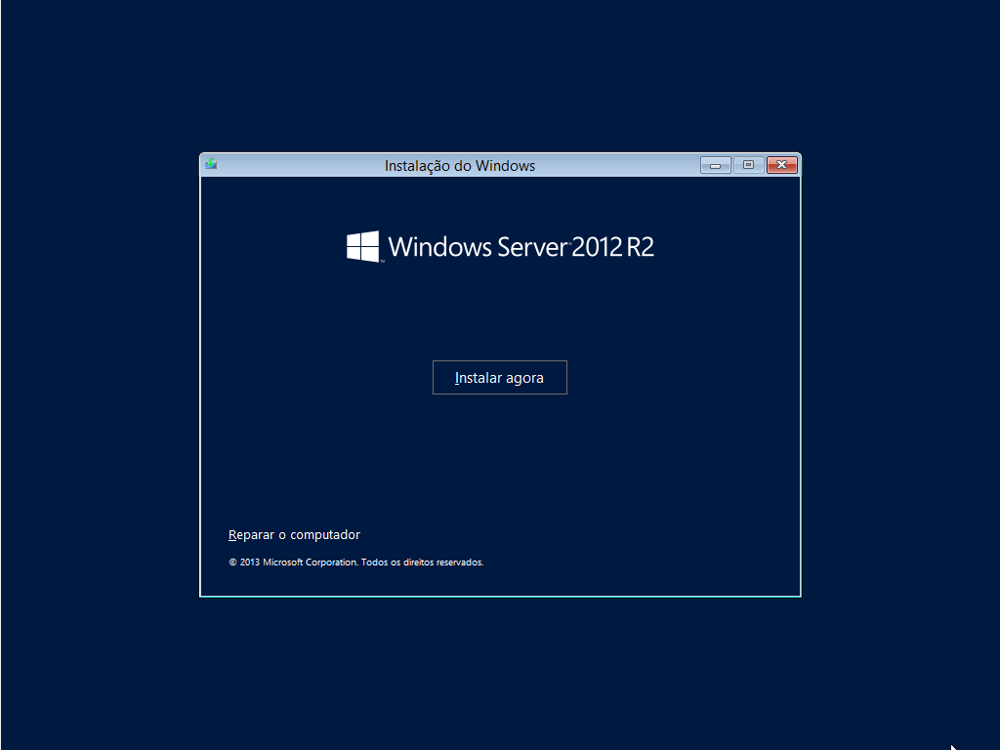
 
# Passo 3
>Selecione o "Windows Server 2012 R2 Standard (Servidor com GUI) X64 21/11/2014" .e depois "Avançar"
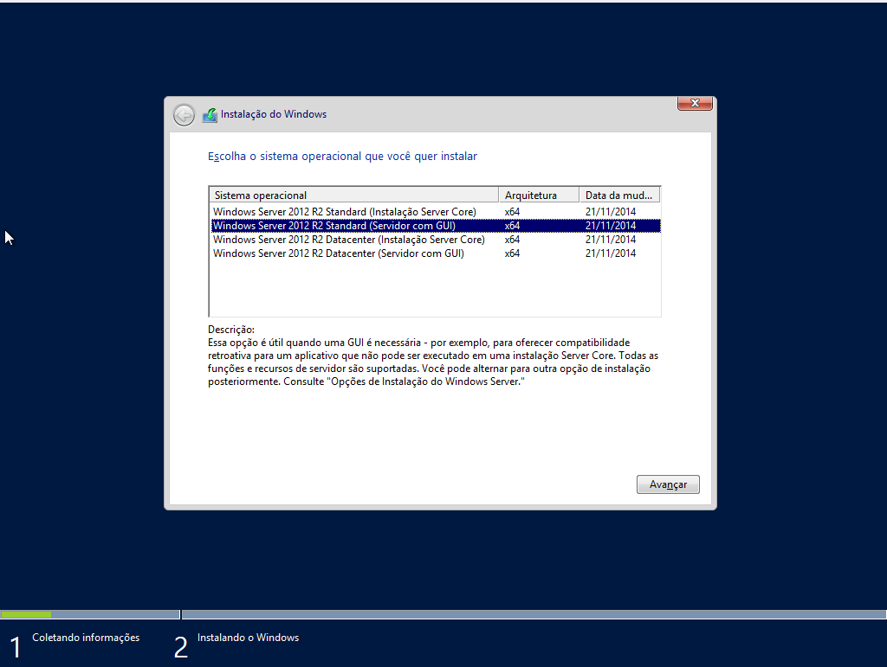
 
# Passo 4
>Aceite os termos de licença e clique em "Avançar".
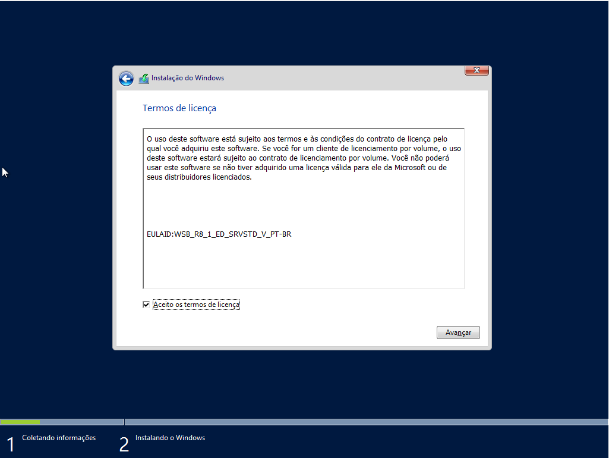
 
# Passo 5
>Clique na opção "Personalizada: instalar apenas o Windows (avançado).
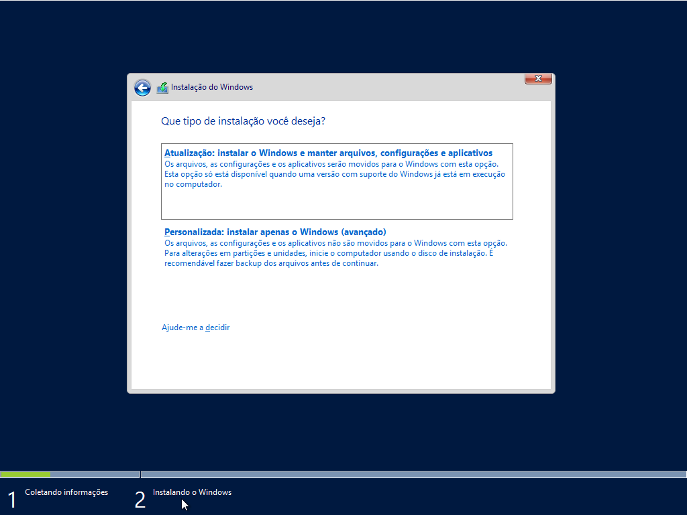
 
# Passo 6
>Selecione a unica unidade e clique em "Novo".

 
# Passo 7
>Altere o tamanho para "61920" MB e clique em "Aplicar".
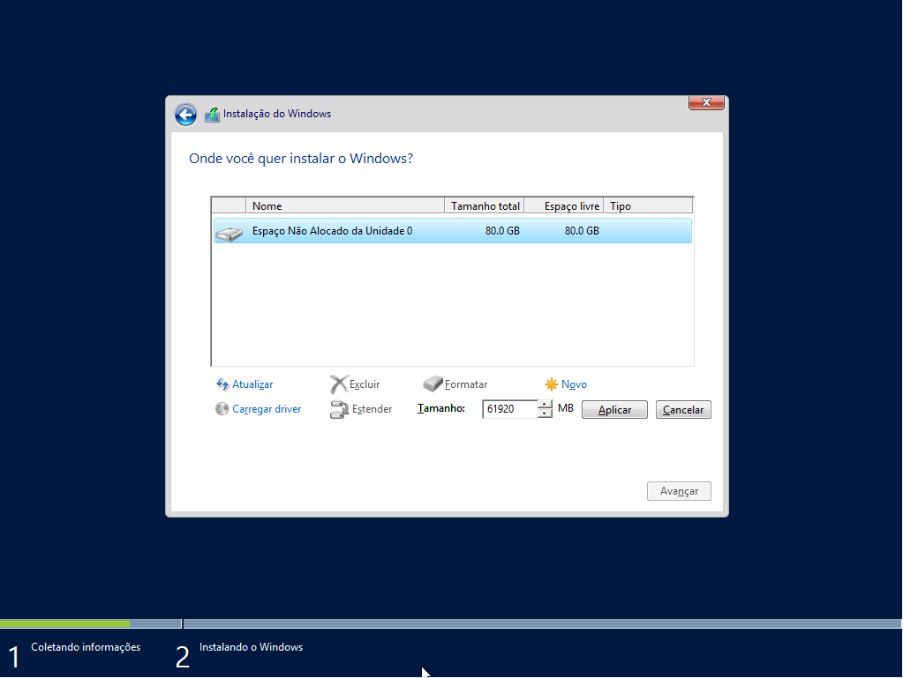
 
# Passo 8
>Clique em "Avançar".
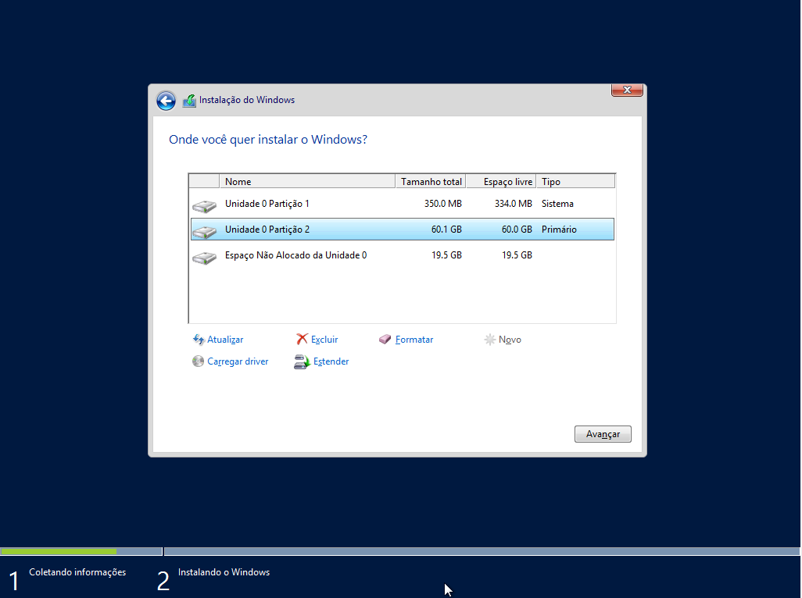
 
# Passo 9
>Aguarde a instalação.
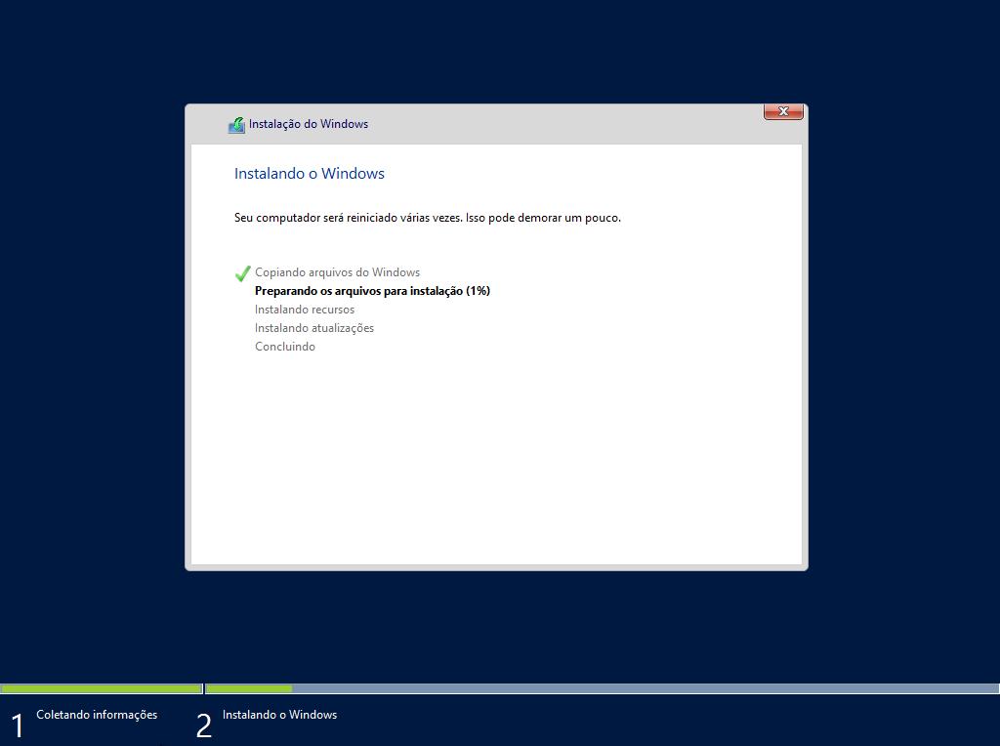
 
# Passo 10
>Aguarde novamente.
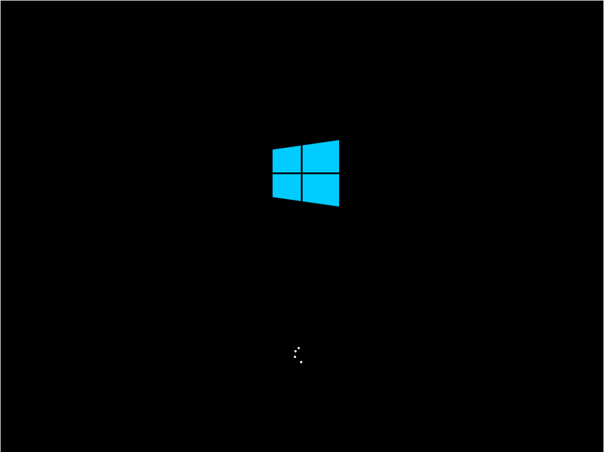
 
# Passo 11
>Insira sua senha
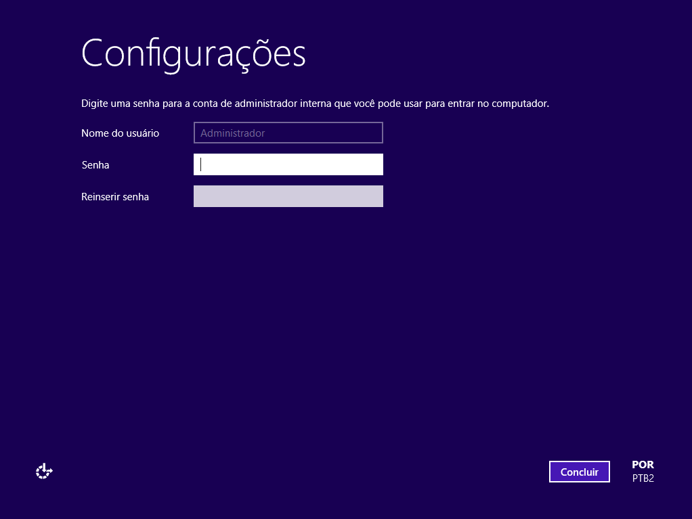
 
# Passo 12
>Aguarde.
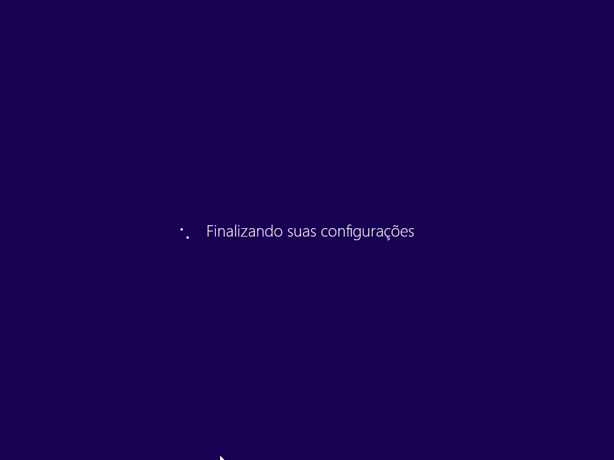
 
# Passo 13
>Com o "Ctrl" pressionado clique no "Insert" para desbloquear a tela.
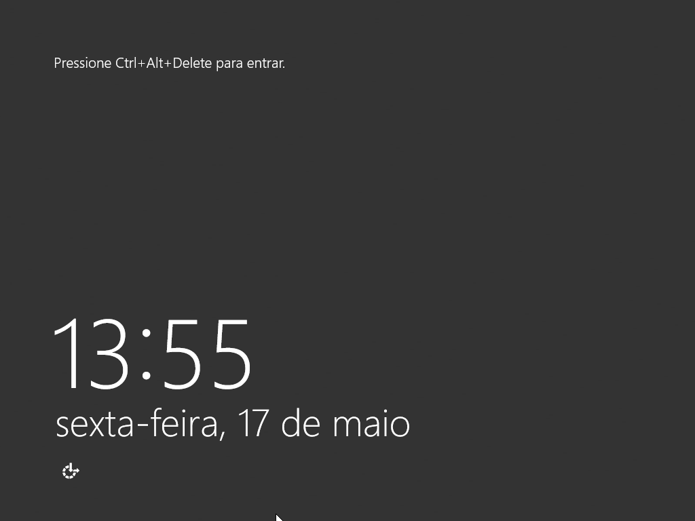
 
# Passo 14
>Insira sua senha para logar.
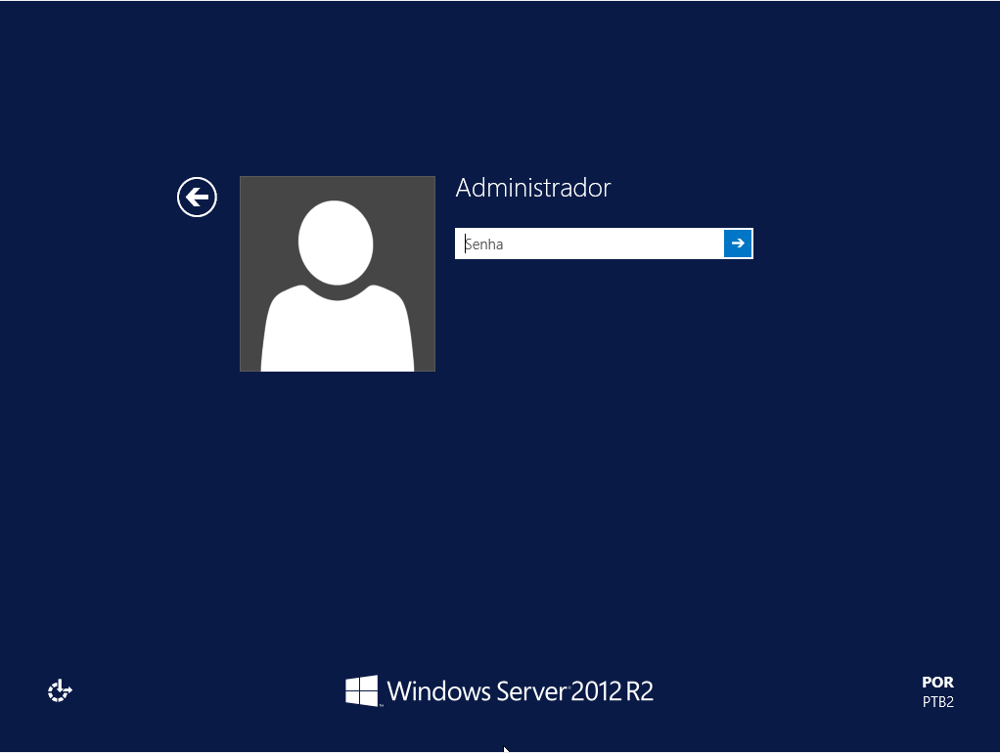
 
# Passo 15
>Fim.
